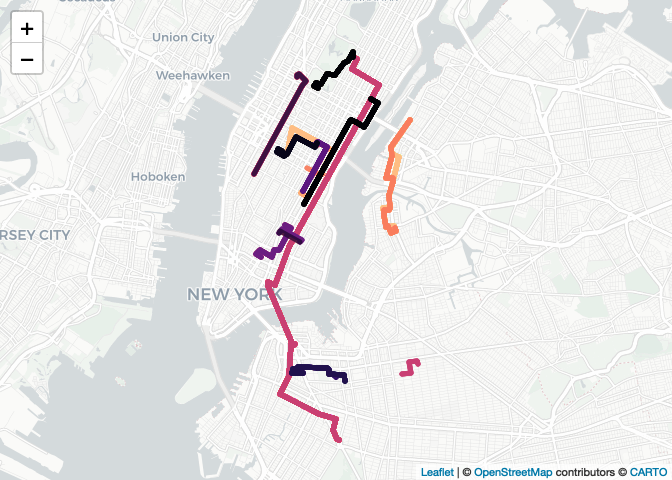

README
================
Matt Kaye
6/7/2020

``` r
rm(list = ls())

library(tidyverse)
```

    ## ── Attaching packages ───────────────────────────────────────────────────────────────── tidyverse 1.3.0 ──

    ## ✓ ggplot2 3.3.1     ✓ purrr   0.3.4
    ## ✓ tibble  3.0.1     ✓ dplyr   1.0.0
    ## ✓ tidyr   1.1.0     ✓ stringr 1.4.0
    ## ✓ readr   1.3.1     ✓ forcats 0.5.0

    ## ── Conflicts ──────────────────────────────────────────────────────────────────── tidyverse_conflicts() ──
    ## x dplyr::filter() masks stats::filter()
    ## x dplyr::lag()    masks stats::lag()

``` r
library(lubridate)
```

    ## 
    ## Attaching package: 'lubridate'

    ## The following objects are masked from 'package:base':
    ## 
    ##     date, intersect, setdiff, union

``` r
library(ggmap)
```

    ## Google's Terms of Service: https://cloud.google.com/maps-platform/terms/.

    ## Please cite ggmap if you use it! See citation("ggmap") for details.

``` r
library(data.table)
```

    ## 
    ## Attaching package: 'data.table'

    ## The following objects are masked from 'package:lubridate':
    ## 
    ##     hour, isoweek, mday, minute, month, quarter, second, wday, week,
    ##     yday, year

    ## The following objects are masked from 'package:dplyr':
    ## 
    ##     between, first, last

    ## The following object is masked from 'package:purrr':
    ## 
    ##     transpose

``` r
library(viridis)
```

    ## Loading required package: viridisLite

``` r
library(sf)
```

    ## Linking to GEOS 3.7.2, GDAL 2.4.2, PROJ 5.2.0

``` r
library(units)
```

    ## udunits system database from /Library/Frameworks/R.framework/Versions/4.0/Resources/library/units/share/udunits

``` r
library(ggthemes)
library(parallel)
library(leaflet)
library(rjson)
library(mapview)
library(magick)
```

    ## Linking to ImageMagick 6.9.9.39
    ## Enabled features: cairo, fontconfig, freetype, lcms, pango, rsvg, webp
    ## Disabled features: fftw, ghostscript, x11

``` r
library(rprojroot)
library(widgetframe)
```

    ## Loading required package: htmlwidgets

``` r
knitr::opts_chunk$set(echo = T, warning = F, message = F)

PROJECT_ROOT <- find_root('CitiBike.Rproj')
```

## Exploring the New York City CitiBike data

## Plots

#### Visualizing Commute Patterns – Heatmap of start and end stations by time of day


#### Coronavirus Impact on Ridership


#### Common Routes

``` r
df <- read.csv(paste(PROJECT_ROOT, '/data/for_common_routes_leaflet.csv', sep = ""))

grouped_coords <- function(coord, group, order) {
  data_frame(coord = coord, group = group) %>%
    group_by(group) %>%
    purrrlyr::by_slice(~c(.$coord, NA), .to = "output") %>%
    left_join(
      data_frame(group = group, order = order) %>% 
        distinct()) %>%
    arrange(order) %>%
    .$output %>%
    unlist()
}

pal <- colorFactor(
  palette = "magma", domain = NULL)

# Map using Leaflet R
l <- leaflet(df) %>%
  addProviderTiles("CartoDB.Positron") %>% 
  addPolylines(
    lng = ~grouped_coords(lon, routeid, rownames(df)),
    lat = ~grouped_coords(lat, routeid, rownames(df)),
    color = ~pal(df$numroute))

l %>%
  frameWidget()
```

<!-- -->
